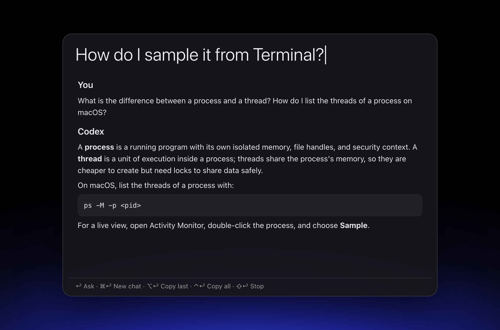
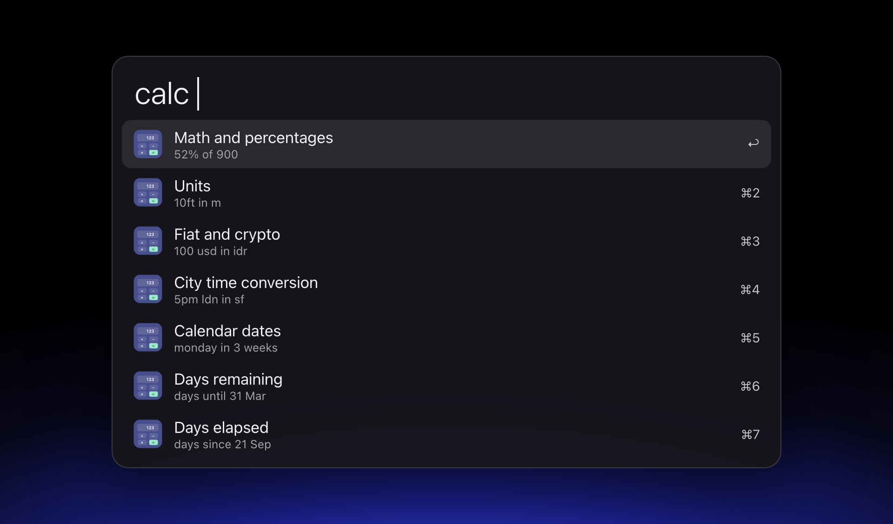
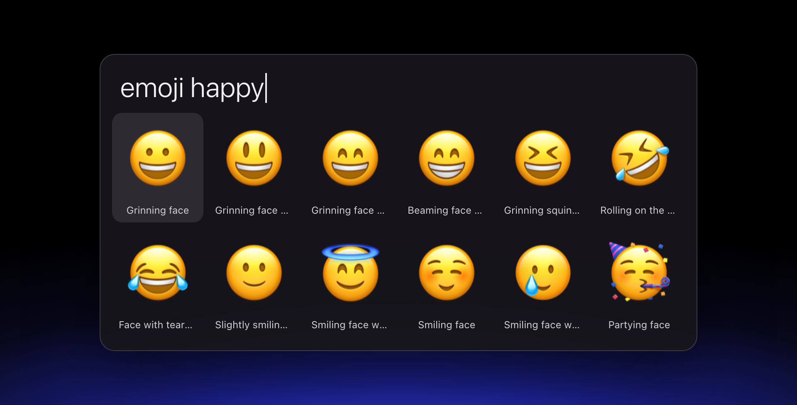
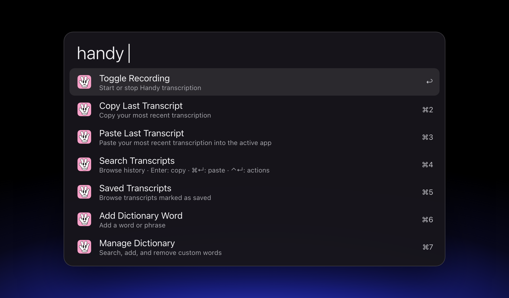
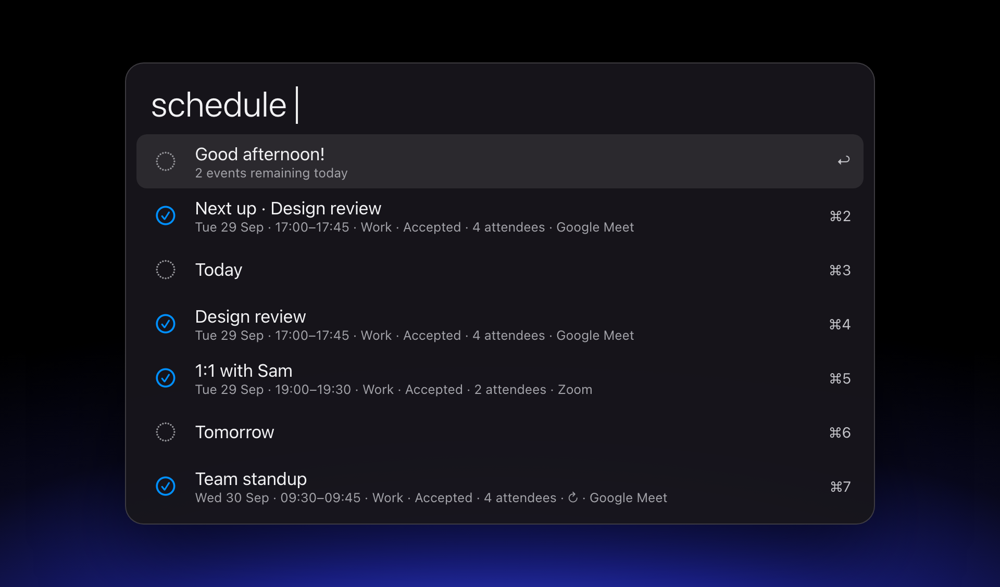
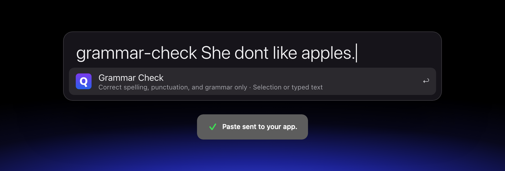
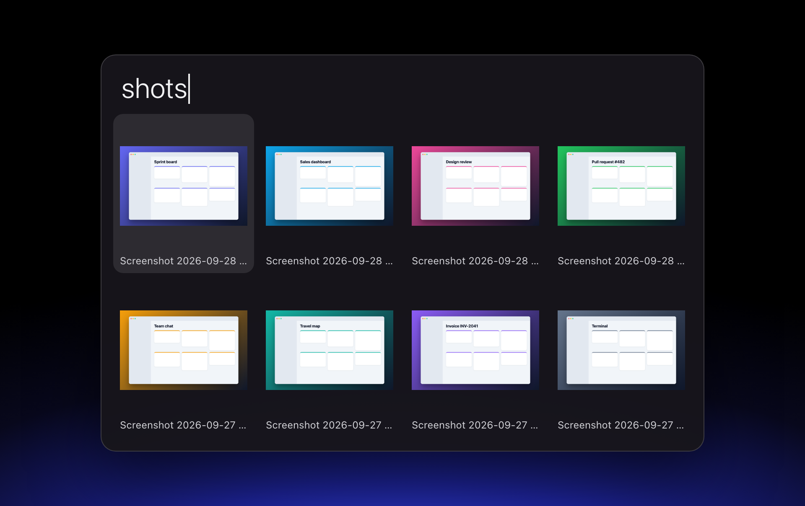
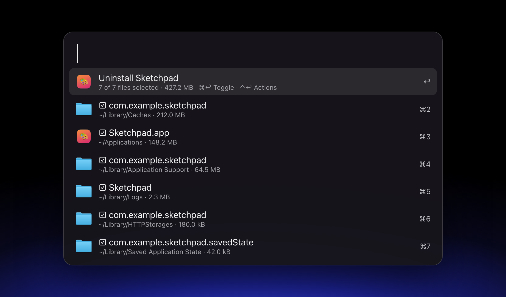
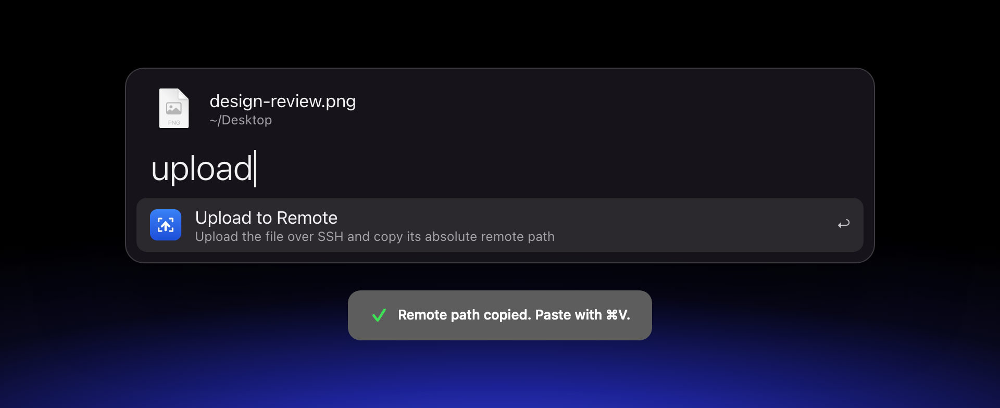

# Alfred Workflows

Ten workflows for [Alfred 5](https://www.alfredapp.com) on macOS: a calculator, an emoji picker, an app uninstaller, a calendar agenda, AI chat and writing tools, and more. Most are native Rust binaries with no runtime dependencies.

Every workflow with native code has **two downloads: one for Apple Silicon and one for Intel**. Each download contains a binary for that CPU only, so pick the one that matches your Mac. AI Chat has no native code, so a single download works on both.

All workflows need Alfred 5 with the [Powerpack](https://www.alfredapp.com/powerpack/).

## Download

| Workflow | What it does | Apple Silicon | Intel |
| --- | --- | --- | --- |
| [AI Chat](#ai-chat) | Chat with Codex, Claude Code, or OpenCode | [1.0.1](https://github.com/ariestwn/alfred-workflows/releases/download/ai-chat-v1.0.1/ai-chat-1.0.1.alfredworkflow) | same file |
| [Calculator Rust](#calculator-rust) | Math, units, currencies, dates, time zones | [0.1.7](https://github.com/ariestwn/alfred-workflows/releases/download/calculator-v0.1.7/calculator-0.1.7-apple-silicon.alfredworkflow) | [0.1.7](https://github.com/ariestwn/alfred-workflows/releases/download/calculator-v0.1.7/calculator-0.1.7-intel.alfredworkflow) |
| [Emoji](#emoji) | Emoji picker with optional semantic search | [0.1.0](https://github.com/ariestwn/alfred-workflows/releases/download/emoji-v0.1.0/emoji-0.1.0-apple-silicon.alfredworkflow) | [0.1.0](https://github.com/ariestwn/alfred-workflows/releases/download/emoji-v0.1.0/emoji-0.1.0-intel.alfredworkflow) |
| [Handy Rust](#handy-rust) | Control Handy speech-to-text | [0.1.0](https://github.com/ariestwn/alfred-workflows/releases/download/handy-v0.1.0/handy-0.1.0-apple-silicon.alfredworkflow) | [0.1.0](https://github.com/ariestwn/alfred-workflows/releases/download/handy-v0.1.0/handy-0.1.0-intel.alfredworkflow) |
| [Apple Music + Audio Format](#apple-music--audio-format) | Bit-perfect playback: match your DAC to the track | [1.0.0](https://github.com/ariestwn/alfred-workflows/releases/download/music-v1.0.0/music-1.0.0-apple-silicon.alfredworkflow) | [1.0.0](https://github.com/ariestwn/alfred-workflows/releases/download/music-v1.0.0/music-1.0.0-intel.alfredworkflow) |
| [My Schedule](#my-schedule) | Calendar agenda, join calls, free slots, new events | [0.1.2](https://github.com/ariestwn/alfred-workflows/releases/download/my-schedule-v0.1.2/my-schedule-0.1.2-apple-silicon.alfredworkflow) | [0.1.2](https://github.com/ariestwn/alfred-workflows/releases/download/my-schedule-v0.1.2/my-schedule-0.1.2-intel.alfredworkflow) |
| [QuickAI](#quickai) | Fix, improve, or grammar-check selected text | [0.2.0](https://github.com/ariestwn/alfred-workflows/releases/download/quickai-v0.2.0/quickai-0.2.0-apple-silicon.alfredworkflow) | [0.2.0](https://github.com/ariestwn/alfred-workflows/releases/download/quickai-v0.2.0/quickai-0.2.0-intel.alfredworkflow) |
| [Screenshots Rust](#screenshots-rust) | Browse thousands of screenshots in a grid | [0.1.0](https://github.com/ariestwn/alfred-workflows/releases/download/screenshots-rust-v0.1.0/screenshots-rust-0.1.0-apple-silicon.alfredworkflow) | [0.1.0](https://github.com/ariestwn/alfred-workflows/releases/download/screenshots-rust-v0.1.0/screenshots-rust-0.1.0-intel.alfredworkflow) |
| [Uninstaller Rust](#uninstaller-rust) | Uninstall apps and their leftover files | [0.4.1](https://github.com/ariestwn/alfred-workflows/releases/download/uninstaller-v0.4.1/uninstaller-0.4.1-apple-silicon.alfredworkflow) | [0.4.1](https://github.com/ariestwn/alfred-workflows/releases/download/uninstaller-v0.4.1/uninstaller-0.4.1-intel.alfredworkflow) |
| [Upload to Remote](#upload-to-remote) | Upload a file over SSH, copy its remote path | [0.2.0](https://github.com/ariestwn/alfred-workflows/releases/download/kraely-upload-v0.2.0/kraely-upload-0.2.0-apple-silicon.alfredworkflow) | [0.2.0](https://github.com/ariestwn/alfred-workflows/releases/download/kraely-upload-v0.2.0/kraely-upload-0.2.0-intel.alfredworkflow) |

Older and newer versions are on the [releases page](https://github.com/ariestwn/alfred-workflows/releases). Each workflow has its own release, tagged `<workflow>-v<version>`.

### Which download do I need?

Open the Apple menu → **About This Mac**. If it lists a **Chip** such as Apple M1 or M4, use **Apple Silicon**. If it lists an Intel **Processor**, use **Intel**. In Terminal, `uname -m` prints `arm64` for Apple Silicon and `x86_64` for Intel.

On an Intel Mac, the Apple Silicon build fails with "Bad CPU type in executable". On Apple Silicon, the Intel build only runs through Rosetta. If you picked the wrong one, delete the workflow in Alfred Preferences and import the other download.

### Install

Double-click the `.alfredworkflow` file and choose **Import** in Alfred. To update, import the newer file; Alfred keeps your settings. Most workflows have options under **Alfred Preferences → Workflows → (workflow) → Configure Workflow…**.

The binaries are ad-hoc signed, not notarized. If macOS says a workflow's binary "can't be opened", open **System Settings → Privacy & Security** and choose **Open Anyway**, or clear the download flag on the installed workflow: in Alfred, right-click the workflow → **Open in Finder**, then run `xattr -dr com.apple.quarantine .` in that folder.

## Workflows

The screenshots show each workflow's real output, produced by running its binary against demo data (no personal calendars, files, or chats) and drawn in an Alfred-style window. See [Screenshots](#regenerating-the-screenshots) below.

### AI Chat

Chat with your signed-in **Codex**, **Claude Code**, or **OpenCode** CLI in Alfred's Text View. No API key goes into Alfred; the workflow reuses each CLI's own login. Source: [`alfred-ai-chat`](alfred-ai-chat).



| Input | Action |
| --- | --- |
| `ai <question>` | Ask the default provider (set in Configure Workflow) |
| `codex <question>`, `claude <question>`, `opencode <question>` | Ask a specific provider; each keeps its own conversation |
| Keyword alone | Reopen that provider's current conversation, including an answer still in progress |
| `aihistory` | Browse and resume archived conversations |
| In a chat: ↩ / ⌘↩ / ⌥↩ / ⌃↩ / ⇧↩ | Send / new chat / copy last answer / copy whole chat as Markdown / stop |
| fn↩ | Multiline editor |

- Universal Actions **Ask Codex**, **Ask Claude**, and **Ask OpenCode** start a chat from selected text. Hotkeys and the external triggers `ask_ai`, `ask_codex`, `ask_claude`, and `ask_opencode` are included.
- Model and reasoning effort are chosen per provider, with an optional custom model ID, a system prompt, context length, and timeout.
- Requires Alfred 5.5+, `/usr/bin/python3` (Xcode Command Line Tools), and at least one of the three CLIs.

### Calculator Rust

Natural-language math, unit and currency conversion, dates, and time zones. Source: [`alfred-calculator`](alfred-calculator).



| Input | Result |
| --- | --- |
| `calc (20 + 5) * 4`, `calc 52% of 900`, `calc 10000+10%` | Arithmetic, percentages, and percent-change operators |
| `calc 10ft in m`, `calc 2 inches in px at 72 ppi` | Units, including screen pixels at a given PPI |
| `calc 100 usd in idr`, `calc 0.1 BTC in IDR` | 166 fiat and 18 crypto currencies, with cached, no-key exchange rates |
| `calc 5pm ldn in sf`, `calc time in tokyo`, `calc diff Paris` | Time zones by city, airport code, or IANA name, with DST |
| `calc days until 31 Mar`, `calc days since 21 Sep`, `calc monday in 3 weeks` | Date arithmetic and countdowns |
| `calc 15% tip on 42`, `calc 20% off 80`, `calc $123 at 7% after 3 years` | Tips, discounts, and compound growth |
| `calc 145 mins to timespan`, `calc 55h in workdays`, `calc workhours in 2023` | Durations and work schedules |
| `fx 100` → pick a currency | Currency browser with favorites first |

- ↩ copy the answer, ⇧↩ copy rounded, ⌘↩ copy unformatted, ⌥↩ paste into the front app, ⌘L Large Type.
- Universal Actions **Calculate Selected Text** and **Convert Currency**, plus an optional hotkey.
- Configure number format (1,234.56 or 1.234,56), precision, time zone, favorite currencies, and offline mode.

### Emoji

A Raycast-style emoji picker in Alfred's Grid View, with offline keyword search and optional semantic search by meaning through [TypeSafe Jev](https://docs.typesafe.ai). Source: [`alfred-emoji`](alfred-emoji).



| Input | Action |
| --- | --- |
| `emoji` | Browse all 1,923 emoji, a page at a time |
| `emoji happy` | Search names and CLDR keywords (works offline) |
| `emoji i got promoted` | Also search by meaning, when a TypeSafe API key is set |
| ↩ / ⌘↩ / ⌥↩ | Paste the emoji / copy it / copy its name |

- The optional **TypeSafe API key** is entered in Configure Workflow. It is marked "don't export", so it never leaves your Mac inside an exported workflow.
- Requires Alfred 5.5+.

### Handy Rust

Control the [Handy](https://handy.computer) speech-to-text app from Alfred: recording, transcripts, models, languages, and the custom dictionary. Source: [`alfred-handy`](alfred-handy).



| Keyword | Action |
| --- | --- |
| `handy` | All commands |
| `hrec` / `hcancel` | Start or stop recording / cancel the current operation |
| `hcopy` / `hpaste` | Copy or paste the latest transcript |
| `hhistory [query]` / `hsaved [query]` | Search all transcripts / saved transcripts |
| `hmodel` / `hlang` | Switch to a downloaded model / a supported language |
| `hword <word>` / `hdict` | Add a dictionary word / manage the dictionary |
| `hfolder` | Open the recordings folder in Finder |

- In history: ↩ copy, ⌘↩ paste, ⌥↩ reveal the recording, ⌃↩ more actions (full text, save, delete to Trash).
- Reads only local Handy data; no network requests. Requires Alfred 5.5+ and Handy installed.

### Apple Music + Audio Format

Bit-perfect Apple Music: a background helper detects each track's real sample rate and bit depth, and switches your DAC to match. It includes a menu bar now-playing card. Source: [`alfred-music`](alfred-music).


| Keyword | Action |
| --- | --- |
| `np` | Current track and its live format; ↩ copies a summary |
| `audio` | List the formats your output device supports; ↩ switches |
| `npauto` | Turn automatic format following on or off |
| `nplog` | View or clear the format-switch log |
| `npmenu` | Show or hide the menu bar icon |
| `npstop` / `npstart` | Stop or resume the background helper |

- The menu bar card shows artwork, format, playback controls, and the device's current format. Right-click for **Switch Format**, auto-follow, and sample-rate text in the menu bar.
- Requires macOS 13+ and a DAC or audio interface with more than one sample rate.

### My Schedule

Your macOS Calendar agenda in Alfred, covering every account that syncs to Calendar (Google, iCloud, Exchange, and others). Source: [`alfred-my-schedule`](alfred-my-schedule).



| Input | Action |
| --- | --- |
| `schedule` | Greeting, next meeting, and upcoming agenda |
| `schedule design`, `schedule tomorrow`, `schedule week`, `schedule 2026-10-01` | Filter by title, day, week, month, or date |
| `snext` | Next meeting; ↩ joins its call |
| `scal` | Show or hide calendars |
| `snew Focus \| tomorrow 14:00 \| 60` | Create an event after previewing it |
| `sfree today` / `sfree week` | Copy your free slots within work hours |

- On an event: ↩ open in Calendar, ⌘↩ join the call (Zoom, Meet, Teams, Webex, FaceTime, and more), ⌥↩ actions, ⇧↩ copy details, ⌃↩ copy attendees.
- Calendar data stays on your Mac; no external services. Requires macOS 14+.

### QuickAI

Rewrite selected text in any app with your signed-in Codex, Claude Code, or OpenCode CLI, then paste the result back in place. Source: [`alfred-quickai`](alfred-quickai).



| Keyword / Universal Action | Action |
| --- | --- |
| `quickfix` / **QuickAI · Quickfix** | Fix typos, grammar, and awkward phrasing with minimal edits |
| `improve-writing` / **QuickAI · Improve Writing** | Rephrase casually, preserving meaning |
| `grammar-check` / **QuickAI · Grammar Check** | Correct spelling, punctuation, and grammar only |

- Works on the current selection or on text typed after the keyword. Hotkeys and `alfred://runtrigger/com.ariestwn.quickai/<command>/` deeplinks are included.
- Output: replace the selection (default), copy, or both. A small status popup shows progress without taking focus.
- Per-provider model and effort, custom prompts per command, and a global prompt. Requires Accessibility permission for Alfred.

### Screenshots Rust

A fast grid browser for a screenshot folder, even one with tens of thousands of images. Source: [`alfred-screenshots-rust`](alfred-screenshots-rust).



| Input | Action |
| --- | --- |
| `shots` | Newest screenshots, one page at a time |
| `shots invoice`, `shots 2026-09` | Search file names and dates across the whole folder |
| ↩ | Full-size preview |
| ⌘↩ / ⌥↩ / ⌃↩ | Copy the image / reveal in Finder / copy its path |

- Thumbnails are generated natively and cached, so large folders stay responsive.
- Configure the folder (default `~/Pictures/Screenshot`), page size, and preview size. Requires Alfred 5.5+.

### Uninstaller Rust

Find an app, review its related files, and move them to the Trash. Apps installed with Homebrew Cask are removed through Homebrew. Source: [`alfred-uninstaller`](alfred-uninstaller).



| Input | Action |
| --- | --- |
| `uninstall [name]` | Search apps by name or bundle ID; ↩ lists the app's files |
| ⌘↩ on a file / on the header | Toggle that file / toggle all |
| ↩ | Uninstall the selected app and files |
| ⌃↩ | Actions: select all or none, sort, scan details |
| ⌥↩ / ⌘C / ⇧ | Reveal in Finder / copy the path / Quick Look |

- Finds preferences, caches, containers, logs, saved state, and other files by exact bundle ID, with sizes. Selected files (and apps not managed by Homebrew) go to the Trash, and Finder asks for Touch ID or your password when needed.
- Universal Action **Uninstall Application…** and the external trigger `uninstall_app`. Requires macOS 12+.

### Upload to Remote

A Universal Action that uploads the selected file to your server over SSH (`scp`), then copies its absolute remote path. Source: [`alfred-kraely-upload`](alfred-kraely-upload).



1. In Configure Workflow, set **SSH host** to an alias from `~/.ssh/config` or `user@hostname`, and set the remote folder.
2. Select a file in Finder, open Universal Actions, and choose **Upload to Remote**.
3. When the popup says **Remote path copied**, paste it with ⌘V.

- Uses your existing SSH keys, agent, and host-key checks; it stores no passwords or keys. The clipboard only changes after a successful upload.
- Other workflows and scripts can call the external trigger `upload` with a file path. Requires macOS 14+ and key-based SSH login.

## Build from source

You need Xcode Command Line Tools, Python 3, and Rust installed with [rustup](https://rustup.rs), with both macOS targets:

```sh
rustup target add aarch64-apple-darwin x86_64-apple-darwin
./scripts/release.sh
```

`release.sh` builds every workflow for Intel and then Apple Silicon, writes the archives to `release/`, and runs `scripts/check_release.py`. That script confirms each archive contains only binaries for its CPU and no local settings or secret-like strings.

To build one workflow, run its `build.sh`. It builds for your Mac's CPU unless you pass a target:

```sh
cd alfred-calculator
./build.sh                                   # this Mac
TARGET=x86_64-apple-darwin ./build.sh        # Intel
TARGET=aarch64-apple-darwin ./build.sh       # Apple Silicon

cd ../alfred-music
ARCHS=x86_64 ./build.sh                      # Swift workflow: arm64, x86_64, or both (default)
```

The archive is written to that workflow's `dist/` folder. Each workflow's own README covers its tests, settings, and internals in detail.

### Regenerating the screenshots

```sh
(cd alfred-quickai && ./scripts/cargo.sh build --locked)
(cd alfred-kraely-upload && ./scripts/cargo.sh build --locked)
python3 scripts/screenshots/make.py
```

The script runs each workflow's built binary against temporary demo data: a fake calendar, a folder of generated images, a placeholder app, and a sample chat. It then captures the output with headless Chromium (Playwright's `chrome-headless-shell` if installed, otherwise Google Chrome) into `docs/screenshots/`. The QuickAI and Upload to Remote status popups are rendered by their debug builds and briefly appear on screen while it runs.

## License

[MIT](LICENSE). Third-party notices ship inside each workflow, in `THIRD_PARTY_NOTICES.md` or `licenses/`.
