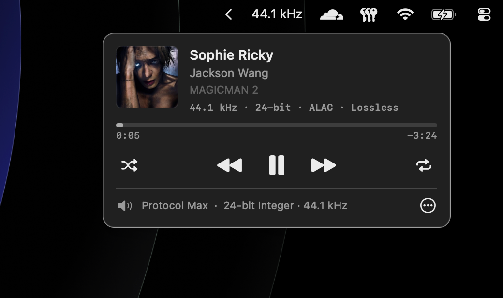
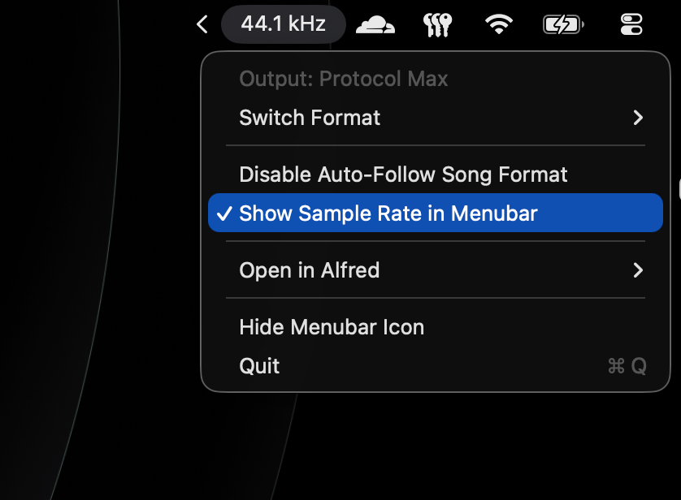
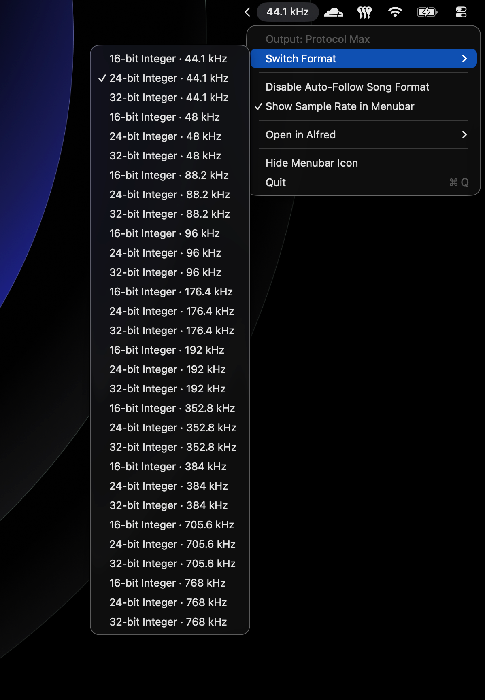
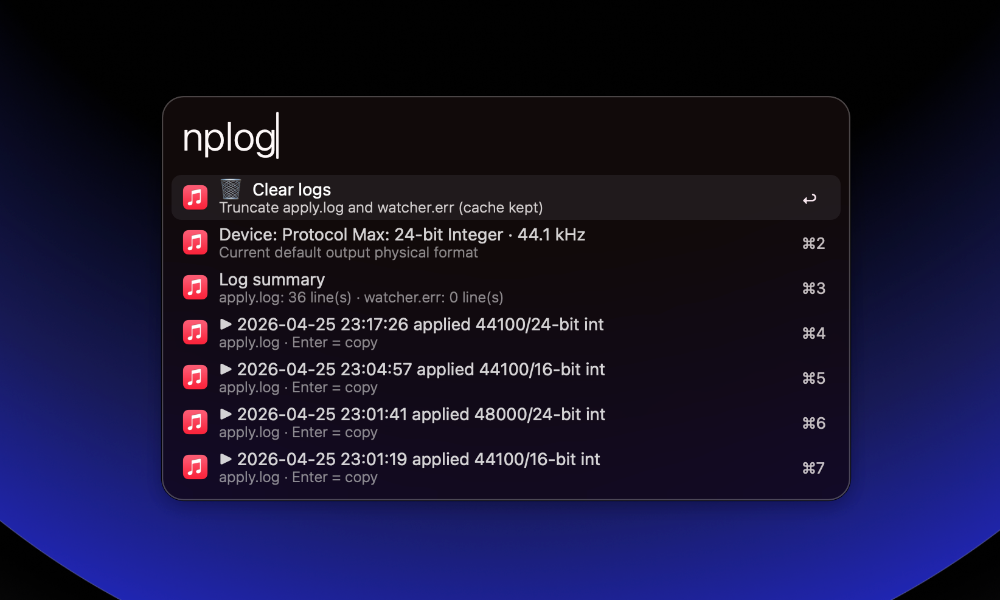

# alfred-apple-music-format

> Bit-perfect Apple Music on macOS — detects the live audio format and auto-switches your DAC sample rate. Menubar app + Alfred workflow.

## What this does

Apple Music on macOS does **not** automatically reconfigure your output device's sample rate to match the source material. Play a 192 kHz / 24-bit hi-res master through a DAC stuck at 44.1 kHz / 16-bit and macOS silently downsamples it. Lossless becomes lossy.

This project fixes that.

A small background daemon tails the system log for `MediaToolbox` format reports from Music.app, parses the live codec / sample rate / bit depth, and (optionally) re-configures the active output device via CoreAudio HAL to match — bit-perfect playback, automatically. The same daemon also drives a SwiftUI now-playing card in the menubar and a set of Alfred keywords for quick inspection / switching.

## Screenshots

**Now-playing card** (left-click the menubar icon). Format line shows the live codec / rate / depth as decoded by Music.app. The footer shows the output device's currently-configured physical format.



**Action menu** (right-click). Toggle auto-follow, switch the menubar between icon and live sample-rate text, jump to any Alfred keyword.



**Switch Format submenu** — full capability list of your DAC, populated from CoreAudio HAL. Pick any to apply immediately.



**`nplog` keyword in Alfred** — inspect the apply log, current device format, and recent applies. Enter to copy, ⌘⏎ to clear.



## Requirements

- **macOS 13+** (Swift literal regex, `kAudioObjectPropertyElementMain`)
- **Alfred 5** with Powerpack
- A DAC or audio interface that exposes multiple sample-rate formats (otherwise there's nothing to switch between)

## Install

1. Download the Apple Silicon or Intel build from the [releases page](https://github.com/ariestwn/alfred-workflows/releases)
2. Double-click to import into Alfred
3. In Alfred, type `np` once — the LaunchAgent installs automatically on first run

The menubar icon (or sample-rate text, if you toggle that) appears immediately. No further setup.

## Alfred keywords

| Keyword | What it does |
|---|---|
| `np` | Show currently-playing track + format. ⏎ copies a one-line summary to clipboard. |
| `audio` | List all formats your default output device supports. ⏎ to switch. |
| `npauto` | Toggle auto-follow: when on, daemon switches DAC format on every track change. |
| `nplog` | View / clear the apply log (history of format switches). |
| `npmenu` | Show / hide the menubar icon (daemon keeps running in background). |
| `npstop` | Stop the background daemon. Stays gone until `npstart`. |
| `npstart` | Resume the daemon after `npstop`. |

## Action menu (right-click menubar icon)

- **Switch Format** — manually pick from your DAC's full capability list (e.g. 16/24/32-bit at 44.1 / 48 / 88.2 / 96 / 176.4 / 192 / 352.8 / 384 / 705.6 / 768 kHz, depending on hardware)
- **Disable / Enable Auto-Follow Song Format** — same as `npauto`
- **Show Sample Rate in Menubar** — replace the music note icon with live text (e.g. `48 kHz`)
- **Open in Alfred** — quick jump to any keyword
- **Hide Menubar Icon** — same as `npmenu`
- **Quit** — terminate the menubar UI (daemon keeps running)

## Auto-follow mode

When **Auto-Follow Song Format** is on (default after install), the daemon:

1. Tails Music.app's `MediaToolbox` format reports from the system log (`/usr/bin/log stream`).
2. On every track change, parses sample rate + bit depth.
3. Calls CoreAudio HAL (`kAudioStreamPropertyPhysicalFormat`) to set the default output device to that exact format.
4. Logs the change to `~/Library/Caches/com.ariestwn.apple-music-audio-format/apply.log`.

If your DAC doesn't expose the exact bit depth at the requested rate, it falls back: 24 → 32 → 16. Your DAC's native rate ladder is the ceiling — if Music plays a 96 kHz track but your DAC tops out at 48 kHz, the daemon picks 48.

Disable it (via `npauto` or the action menu) if you'd rather use Audio MIDI Setup manually, or if format switches cause audible clicks on your hardware.

## Permissions

The daemon needs three macOS permissions. Two prompt automatically; the third may need a manual nudge.

### 1. Automation → Music
**What for:** read track name / artist / album / sample rate from Music.app via AppleScript.
**Auto-prompted:** yes — first time the daemon queries Music.app.

### 2. Automation → System Events
**What for:** drive shuffle / repeat menu items via UI scripting (Music.app's own `shuffle enabled` / `song repeat` AppleScript properties no longer work on recent macOS).
**Auto-prompted:** yes — first time you click the shuffle / repeat button on the popover.

### 3. Accessibility
**What for:** required by System Events to actually invoke menu items in another app. Without it, shuffle / repeat silently no-op with `error -1719 (assistive access)`.
**Auto-prompted:** yes — programmatic prompt on first shuffle / repeat click. If it doesn't appear (e.g. you previously dismissed it), open **System Settings → Privacy & Security → Accessibility** and enable **Apple Music Audio Watcher** manually.

## Troubleshooting

### Menubar icon doesn't appear
- Some menubar utilities hide unsigned items by default (Bartender, Ice, etc.). The app is ad-hoc signed (no paid Apple Developer ID) so they treat it as "unidentified". Add an exception or restart the utility.
- Check the daemon is alive: `pgrep -fl "Apple Music Audio Watcher"`. Should print one process.
- Daemon running but icon hidden: type `npmenu` in Alfred → **Show Icon** (clears the manual hide flag).

### Click does nothing / panel won't open
- Orphan process from a previous install. Force-kill — KeepAlive will respawn within seconds:
  ```bash
  pkill -9 -f "Apple Music Audio Watcher"
  ```

### Shuffle / repeat buttons silently no-op
Stale Accessibility attribution after a rebuild — macOS sometimes caches the old signature path. Reset and re-grant:

```bash
tccutil reset Accessibility com.ariestwn.apple-music-audio-format
```

Then click any control button — the prompt re-appears with the current bundle path.

### `np` returns "AAC" for a track you know is Lossless
- It's a "shared track" — Apple Music streaming, not in your library. The daemon's parsing is correct; Apple is actually streaming AAC for that path. Add the track to your library, or download it for full Lossless.
- Lossless disabled in Music's settings: **Music → Settings → Playback → Audio Quality → Lossless**.

### Auto-apply doesn't switch the DAC
- Open `nplog` and check the **Log summary** — if `apply.log` has recent successful applies but the DAC didn't move, the device is probably in exclusive mode (another app holding it). Close other audio apps and try again, or use the `audio` keyword to switch manually.
- DAC doesn't expose the requested rate. The `audio` keyword shows what it actually supports.

### Daemon comes back after `npstop`
This was a known issue and is fixed: `npstop` writes a `daemon.off` flag that prevents the auto-heal in `np` from re-bootstrapping. Use `npstart` to resume. If you're still seeing it, you're on an older build — re-import the latest `.alfredworkflow`.

### `Bootstrap failed: 5: Input/output error` during install
launchd reentrancy after a rapid bootout/bootstrap. The install script has a retry loop, but if it persists:

```bash
launchctl bootout "gui/$(id -u)/com.ariestwn.apple-music-audio-format" 2>/dev/null
sleep 6
~/Documents/Alfred/Alfred.alfredpreferences/workflows/<workflow-uuid>/install.sh
```

(Alfred → right-click workflow → Open in Finder reveals the workflow folder.)

### Wrong artwork
Artwork comes from the iTunes Search API, matched by title + artist. Generic titles can collide. The next track change re-resolves it. If a specific track is consistently wrong, that's an iTunes Search ranking quirk, not a daemon bug.

### Memory usage looks high in Activity Monitor
"Real Mem" inflates by shared framework pages (AppKit / SwiftUI / CoreFoundation) that every macOS process loads — they don't cost extra RAM. The actual private footprint is ~50 MB, which `vmmap --summary <pid> | grep "Physical footprint"` reveals.

## Architecture

One Mach-O binary (`Apple Music Audio Watcher`), three roles:

- **Background daemon** — tails `/usr/bin/log stream` filtered to Music.app's MediaToolbox subsystem; parses `[FormatID / SampleRate / BitDepth / Rendition]` lines from `FigStreamPlayer`; writes JSON cache + drives auto-apply via CoreAudio HAL.
- **Menubar UI** — same process; `NSStatusItem` left-click → `NSPanel` hosting a SwiftUI now-playing card with a `.menu` material vibrancy blur. Right-click → action `NSMenu`.
- **Alfred CLI helper** (`audio_format`) — small standalone binary; lists / switches CoreAudio physical formats for the `audio` Script Filter and the auto-apply path.

Runs as a user `LaunchAgent` (`com.ariestwn.apple-music-audio-format`) with `KeepAlive=true`, so the daemon respawns on crash.

**Cache files:** `~/Library/Caches/com.ariestwn.apple-music-audio-format/`
- `nowplaying.json` — current format snapshot, consumed by Alfred `np`
- `apply.log` — history of successful auto-applies
- `artwork.jpg` — cached 200×200 album art
- `watcher.err` / `watcher.out` — LaunchAgent stdio for debugging

**Settings flags:** `~/Library/Application Support/com.ariestwn.apple-music-audio-format/`
- `autoapply.off` — disables auto-follow
- `menubar.off` — hides the status icon (daemon stays alive)
- `daemon.off` — `npstop` was invoked; auto-heal in `show.sh` respects this
- `display.mode` — `icon` (default) or `format` for the menubar item content

## Build from source

```bash
git clone https://github.com/ariestwn/alfred-workflows.git
cd alfred-workflows/alfred-music

./build.sh                                        # compile + assemble + zip
open "dist/Apple Music + Audio Format.alfredworkflow"   # import into Alfred
```

`build.sh` produces a universal binary (arm64 + x86_64) by default; `ARCHS=arm64 ./build.sh` or `ARCHS=x86_64 ./build.sh` builds a single architecture, which is what the release downloads use. `workflow/install.sh` thins a universal build to the host arch on import.

## Uninstall

In Alfred: right-click the workflow → **Open in Finder** → run `uninstall.sh`. Then delete the workflow from Alfred.

If you skipped `uninstall.sh` and the daemon still respawns, manual cleanup:

```bash
launchctl bootout "gui/$(id -u)/com.ariestwn.apple-music-audio-format" 2>/dev/null
rm -f ~/Library/LaunchAgents/com.ariestwn.apple-music-audio-format.plist
rm -rf ~/Library/Application\ Support/com.ariestwn.apple-music-audio-format
rm -rf ~/Library/Caches/com.ariestwn.apple-music-audio-format
```

Optionally reset all TCC permissions tied to this app:

```bash
tccutil reset All com.ariestwn.apple-music-audio-format
```

## License

MIT. See `LICENSE`.
